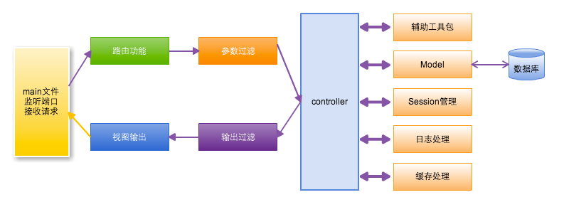

# 基础模块

+ cahce
+ config
+ context
+ httplibs
+ logs
+ orm
+ session
+ toolbox

# 流程



# 项目结构

```
├── conf
│   └── app.conf
├── controllers
│   ├── admin
│   └── default.go
├── main.go
├── models
│   └── models.go
├── static
│   ├── css
│   ├── ico
│   ├── img
│   └── js
└── views
    ├── admin
    └── index.tpl
```

